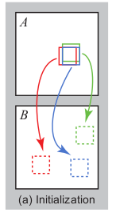
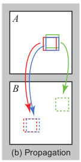
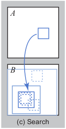
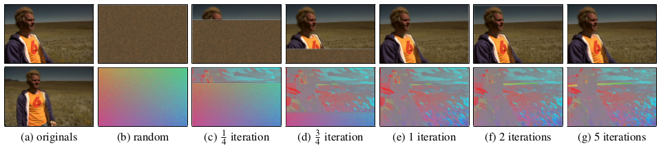

# PatchMatch project proposal

### Project ID and title
1. [Patch Match: A Randomized Correspondence Algorithm for Structural Image Editing ](https://gfx.cs.princeton.edu/pubs/Barnes_2009_PAR/patchmatch.pdf)

### Github link
[project-strawhat](https://github.com/Digital-Image-Processing-IIITH/project-strawhat)

### Team Members
1. [Rahul Sajnani](https://github.com/RahulSajnani) - 20171056
2. [Anoushka Vyas](https://github.com/AnoushkaVyas) - 20171057
3. [Ajay Shrihari](https://github.com/AjayShrihari) - 20171097
4. [Chaitanya Kharyal](https://github.com/kharyal) - 20171208

### Main Goal(s) of the project
The main objective of this project is to present interactive image editing tools using a new randomized algorithm for quickly finding approximate nearest neighbor matches between image patches. This one simple algorithm forms the basis for a variety of tools – image retargeting, completion and reshuffling – that can be used together in the context of a high-level image editing application. One more feature is additional intuitive constraints on the synthesis process that offer the user a level of control unavailable in any other methods.

### Problem definition

#### Notations

f(x, y) determines the location of the patch in image **B** that is closest to the patch at the location (x, y) in image **A**. D(A[x, y]. B[f(x,y)]) determines the distance (can be mean L1 cost)  between the patches of image **A** and image **B**. Here, A[x,y] and B[x,y] determine the patch with center at (x,y) in image A and image B.

#### Algorithm

The algorithm initialises the patch locations by sampling from a uniform random distribution of locations and assigns the initial patch matching error. It then iteratively finds the closest matching patch in a 2 step process:

1. **Propagation:**

   In this step, we find look at the use the locations of (f(x-1, y), f(x, y - 1)) (in even iter) and (f(x + 1, y), f(x, y + 1)) (in odd iter) for closest patch to (x,y). The idea here is that the patch for the neighbors of (x, y) should be close to the patch at (x,y). 

   The final distance D = min(D(A[x, y]. B[f(x,y)]), D(A[x, y]. B[f(x - 1,y)]), D(A[x, y]. B[f(x,y - 1)])).  

   

2. **Random search:**

   Propagation step might converge to a non optimal minima in finding the nearest patch to resolve this the paper uses random search. We search in a larger patch in image B at certain offsets. 

   If pos = f(x, y) (remember this provide position of the closest patch in image B to the (x, y) of image A). 

    pos_new = pos + w*a^{i}*R

   pos_new gives use the new location to search over. R is uniform random in [-1, 1] x [-1, 1]. We search till wa^{i} is smaller than 1 pixel. Here a=1/2.

   

   

### Results of the project

### Milestones and expected timeline

### Dataset
